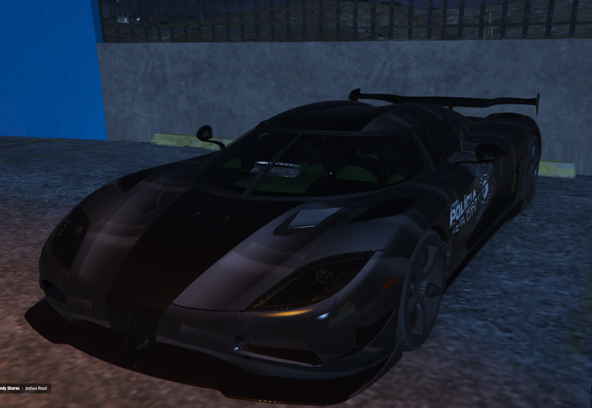
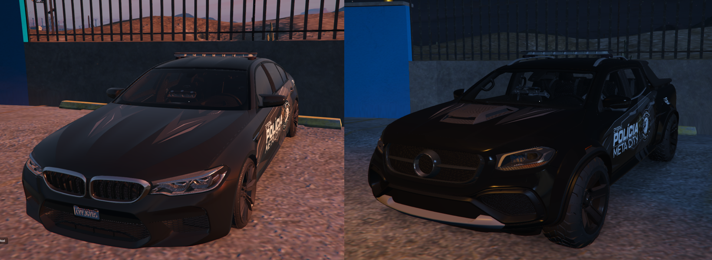
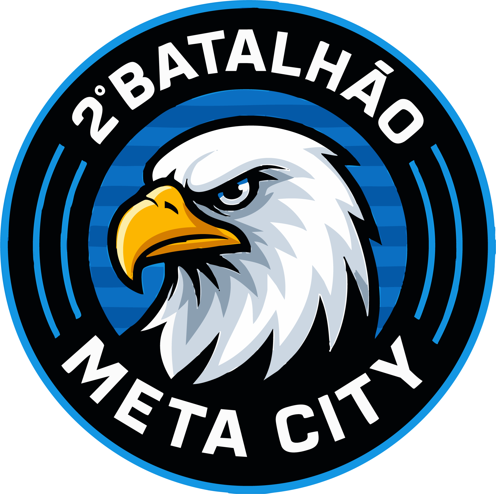

# Viaturas

**Viatura Liberada apenas para Speed**&#x20;

<figure><figcaption></figcaption></figure>

_**Viaturas Liberada para toda a Guarniçao**_

<figure><figcaption></figcaption></figure>

_**Viatura Liberada Apenas para C.H.O.Q.U.E**_

<figure><figcaption></figcaption></figure>

_**Viatura Liberada Apenas para GTM**_

<figure><figcaption></figcaption></figure>

_**Viatura Liberada Apenas para G.R.A.E.R. - C.H.O.Q.U.E**_

<figure><figcaption></figcaption></figure>

### 📝 **Observações Importantes**

* 🚫 **É proibido utilizar viaturas não compatíveis com sua patente e curso concluído.**
* ✅ Viaturas táticas e especializadas **devem ser autorizadas por superiores**, mesmo que o policial tenha patente compatível.
* 🛠️ Em caso de evento especial (blip, operação, etc.), **poderá haver liberação temporária**, sempre mediante comando.

<figure><figcaption></figcaption></figure>
